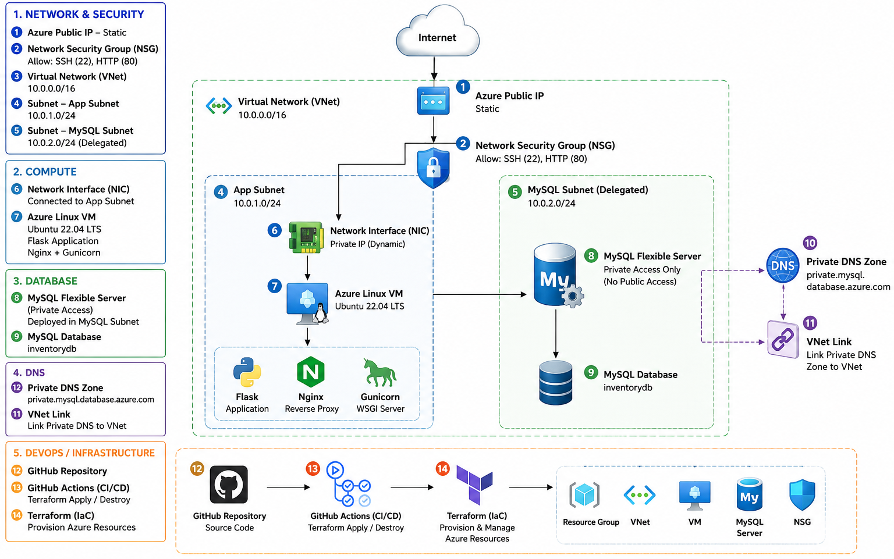

# Azure MySQL Database with Azure VM

A cloud computing project that demonstrates how to deploys a Python Flask web application on an **Azure Linux Virtual Machine** and connects it securely to Azure Database for **MySQL Flexible Server** through a **private Azure Virtual Network**.

The entire infrastructure is provisioned using Terraform, while **cloud-init** automatically configures the VM and **GitHub Actions** provides **CI/CD** automation.

## Architecture Diagram




## 🌍 Access the Application

After deployment:

terraform output application_url

Example:

http://20.x.x.x

Open the URL in a browser.

You should see:

Azure MySQL Inventory

Product name
Quantity
Price

[ Add Product ]


## 🔐 SSH into the VM

Get the public IP:

terraform output vm_public_ip

Connect:

ssh azureadmin@<PUBLIC_IP>

Example:

ssh azureadmin@20.x.x.x


## 🔑 GitHub Secrets

Configure these repository secrets:
```text
AZURE_CLIENT_ID
AZURE_TENANT_ID
AZURE_SUBSCRIPTION_ID
SSH_PUBLIC_KEY
MYSQL_ADMIN_PASSWORD

Navigate to:

GitHub Repository
    ↓
Settings
    ↓
Secrets and variables
    ↓
Actions
    ↓
New repository secret
```

## 🔐 Azure Authentication

GitHub Actions uses Azure federated identity/OIDC authentication.

The deployment flow is:
```text
GitHub Actions
      |
      v
Azure Login
      |
      v
Microsoft Entra ID
      |
      v
Federated Identity
      |
      v
Azure Subscription
      |
      v
Terraform
```
This avoids storing a long-lived Azure client secret in GitHub.


## 📚 Learning Objectives

After completing this project, you should understand:

1. Azure Virtual Networks
2. Azure subnets
3. Network Security Groups
4. Azure Linux Virtual Machines
5. Azure MySQL Flexible Server
6. Private database networking
7. Private DNS
8. Terraform Infrastructure as Code
9. Cloud-init
10. Flask deployment
11. Nginx
12. Gunicorn
13. GitHub Actions
14. Azure OIDC authentication
15. Terraform state
16. Cloud security fundamentals


## 🎯 Skills Demonstrated

This project demonstrates practical experience with:

```text
Cloud Computing
      |
      +-- Microsoft Azure
      |
      +-- Networking
      |
      +-- Virtual Machines
      |
      +-- Managed Databases
      |
      +-- Private Networking

Infrastructure as Code
      |
      +-- Terraform

DevOps
      |
      +-- GitHub
      +-- GitHub Actions
      +-- CI/CD

Linux
      |
      +-- Ubuntu
      +-- SSH
      +-- Nginx
      +-- Gunicorn

Application Development
      |
      +-- Python
      +-- Flask
      +-- MySQL
```


## 🧹 Destroy Infrastructure

When finished testing:

terraform destroy

Or use the GitHub Actions:
```text
GitHub
   ↓
Actions
   ↓
Destroy Azure Infrastructure
   ↓
Run workflow
```
Always verify the Azure Resource Group after destruction to ensure no unwanted billable resources remain.


## 👨‍💻 Author

Saranjib Kuanar

Azure | DevOps | Terraform | Kubernetes | Python | Cloud Infrastructure


